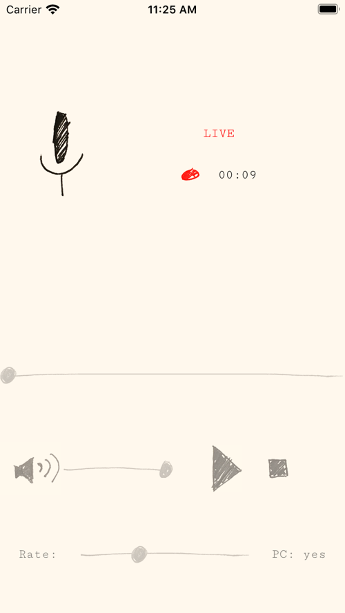

# Expo Audio Recording Example

This is an example cross-platform app implementing Expo's [Audio API](https://docs.expo.io/versions/latest/sdk/audio/) (among a few others, including File System, Asset, and Permissions APIs).

Check out the good stuff in [the App.tsx file](https://github.com/expo/audio-recording-example/blob/master/App.tsx)!

### Please report any issues at the [main Expo repository](https://github.com/expo/expo/issues)

